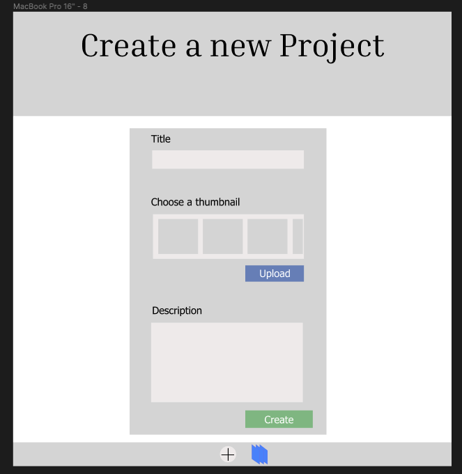
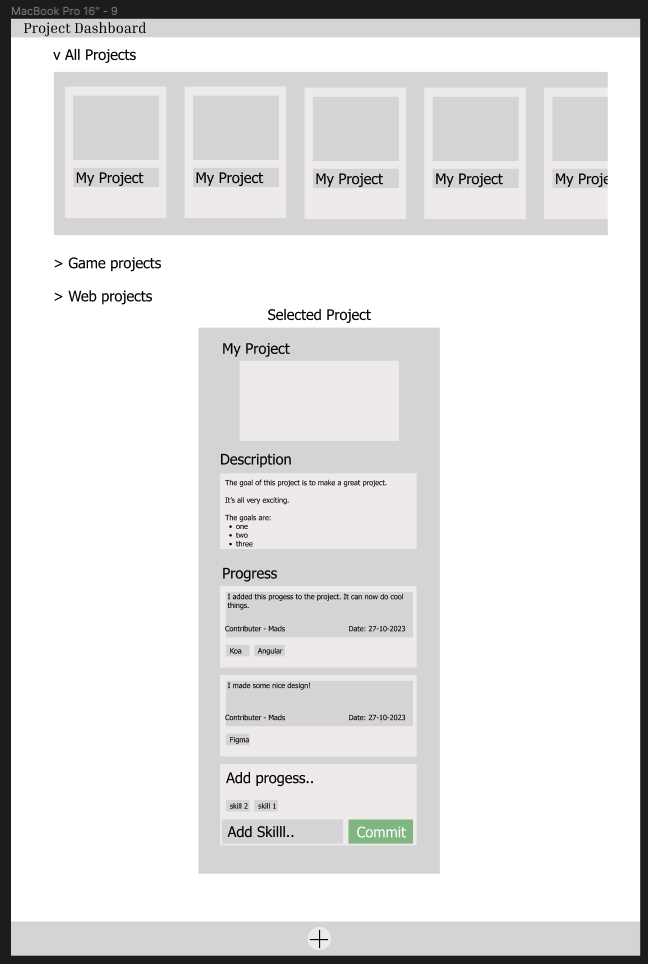

# Blossom

Track the growth of your skills and projects.
Get encouragement from friends by sharing your progress.

## Project description

The app helps users keep track of all the many projects and skills they are working on.

### Base app
Users can create projects that they are working on and commit progress reports as they complete work on a project.
Users can associate progress with specific skills.

It will have a dashboard for projects, where projects can be overviewed by category. 
It will have a dashboard for skills a user has registered, and give an overview of what progress they have made with a specific skill across different projects.

### Social app:

Users will be able to publish/share their progress and projects.
Users have a news feed where they receive published progress from other users.
Users can subscribe to posts on specific skills, projects, topics, or users to prioritize posts from these sources in their feed.

## RoadMap

Part One - Skills, Projects, Progress:
  1. Create projects with a title, description, and a predefined thumbnail
  2. Display a dashboard of projects.
  3. Add progress-comments to a project
  4. Add skills used to progress.
  5. Display a dashboard of skills where users can
      1. Filter progress by skill
      2. Display amount of progress committed pr skill
  6. Add ability to upload custom images to progress commits and projects
  7. Add user defined categories to projects
  8. Add categories to project dashboard

Part Two - Users
  1. Add user registration with Oauth / email-password
  2. Store user sessions in redis

Part Three - Social App 
  1. Add ability to publish progress 
  2. Add a news feed, that display published progress from all users
  3. Be able to subscribe to skills/ projects / users
  4. Prioritise posts you are subscribed too.
  5. Comment and react on posts.

Extra Bonus:
  - Add friends and friends publish scope.
  - Allow collaboration on projects.

## Tech stack

The goal is to make a microservice architecture in docker compose.

### Front End: ###

Angular singlepage app.

### Back End: ###

**Skills and Project api:**

Koa, postgres and sequelize.

**Social Media Posts:**

Apollo graphql mongodb

**Image upload api:**

Koa for uploading resources
nginx for serving files.
Files stored in volume.

**Authentication api:**

Koa/express:
user data stored in sql.
user sessions stored in redis

## Documentation:

### Frontend design:

[figma design](https://www.figma.com/file/WIwDhNRCpPwwNjNXT1EQd6/Skills-and-projects?type=design&node-id=0-1&mode=design&t=JtvvlM3tXYnSzmjQ-0)

**create project**

**project dashboard**

### Project api - SQL design

Project Table:
id, title, thumbnail-link, creation date, description, ownerId

Progress-Project table:
id, projectId, comment, creation date, authorId

Skills table:
id, skillName:

Progress-Skill table:
Id, progressId, skillId
